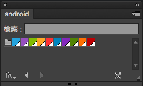
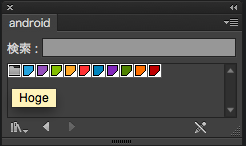

# android-color-swatch-maker

Androidのリソースファイルから、PhotoshopやIllustratorで利用できるスウォッチライブラリを書き出すためのスクリプト。



* 指定したプロジェクト内のリソースファイルで以下のように指定されている値のみ取得をする。

```
<resources>
    <item name="hoge" type="color">#FF33B5E5</item>
</resources>
```


## Usage

### 実行

```
$ bundle install
$ ruby acsm.rb
```

## Options

### --path value / --p value
Androidプロジェクト、もしくはその中のリソースファイルを指定することができます。

```
$ ruby acsm.rb  --path 'Users/tsukajizo/Documents/projects/android/HogeProject/app/src/main/res/'
```

デフォルトでは、カレントディレクトリ以下の全てのXMLファイルから、設定されている色の情報を取得し、ASEファイルを作成します。


### --output value / --o value

出力するASEファイルの名前が指定できます。

```
$ ruby acsm.rb  --output 'sample.ase'
```

デフォルト値 : android.ase

### --name value / --n value

出力するASEファイルに含まれるパレット名が指定できます。これらのパレット名はIllustrator取り込み時に表示されるものです。

デフォルト値 : Android

ex.

```
$ ruby acsm.rb  --n 'Hoge'
```




### サンプル
#### プロジェクト内のリソースファイル

Users/tsukajizo/Documents/projects/android/HogeProject/app/src/main/res/values.color.xml
```
<?xml version="1.0" encoding="utf-8"?>
<resources>
    <item name="blue" type="color">#FF33B5E5</item>
    <item name="purple" type="color">#FFAA66CC</item>
    <item name="green" type="color">#FF99CC00</item>
    <item name="orange" type="color">#FFFFBB33</item>
    <item name="red" type="color">#FFFF4444</item>
    <item name="dark_blue" type="color">#FF0099CC</item>
    <item name="dark_purple" type="color">#FF9933CC</item>
    <item name="dark_green" type="color">#FF669900</item>
    <item name="dark_orange" type="color">#FFFF8800</item>
    <item name="dark_red" type="color">#FFCC0000</item>

    <item name="text_color" type="color">@color/red</item>

    <integer-array name="androidcolors">
        <item>@color/blue</item>
        <item>@color/purple</item>
        <item>@color/green</item>
        <item>@color/orange</item>
        <item>@color/red</item>
        <item>@color/darkblue</item>
        <item>@color/darkpurple</item>
        <item>@color/darkgreen</item>
        <item>@color/darkorange</item>
        <item>@color/darkred</item>
    </integer-array>
</resources>
```

#### 実行

```
$ ruby acsm.rb  --path 'Users/tsukajizo/Documents/projects/android/HogeProject/app/src/main/res/'
```

#### ファイルが作成される

```
.
├── acsm.rb
├── bin
│   └── android.ase #<= added

```

#### Photoshop / Illsutratorなどに取り込む


